## Report

### Normalized Cross Correlation

1. (a) For this problem, I've chosen a game poster and cropped out one of the charecter's face. For clarity, the template is cropped from the main image starting from the pixel (122, 61) with a height of 80 pixels and width of 70 pixels

When we run NCC by traversing the mask on the bigger image, the resulting coreelation output is as follows

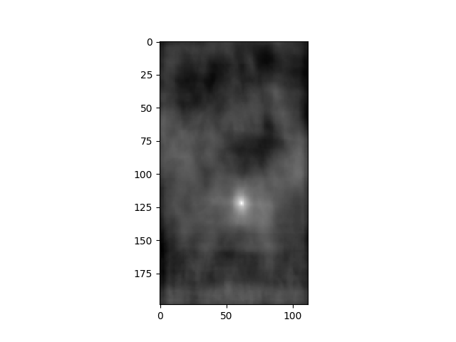

The code output is as follows. Please note that the code calculates from which pixel the template is most similar to bigger image. 

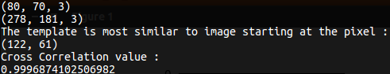

2. (b) When we run the same function with the provided u2cuba.jpg and trailer.png we get the following results

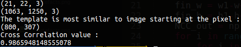

And the resulting output from correlation is as follows

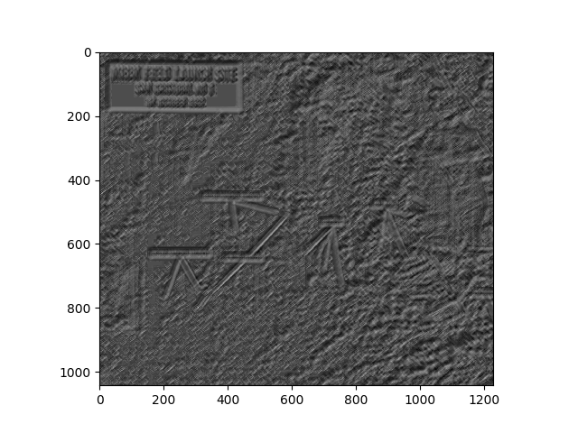

These straight line artefacts in the resulting correlation plot can be explained as follows :

The mask/template is 
 

And the image is 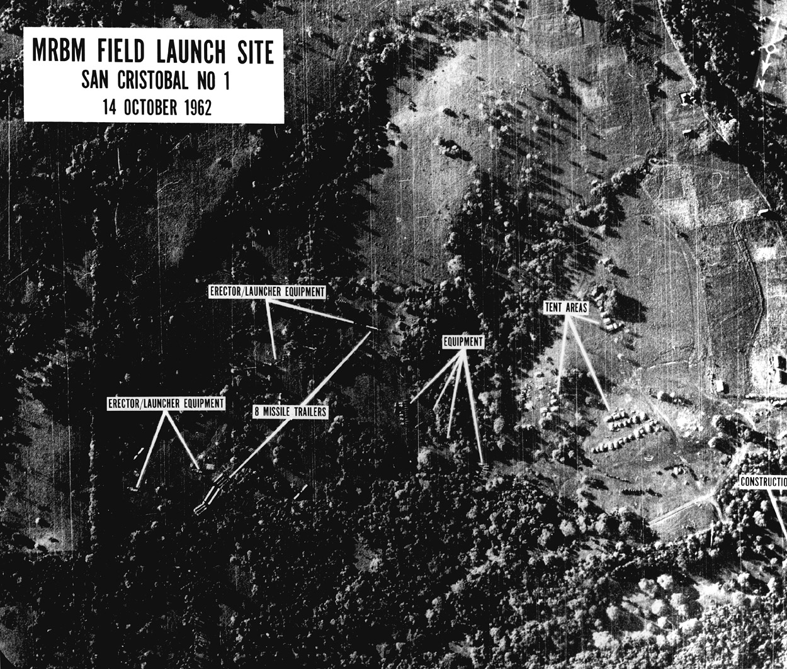

Note that whenever a prong (one of the branches in the E shaped mask/template) is aligned with the straight white lines in the image, we end up having the straight lines in Correlation map

If the branch is perfectly aligned, we get a deeper grove for the line and vice-versa.

All of these artefacts can be explained in two steps.

* A simple convolution between two lines with same slope, say a convolution between :

1 0 0

0 1 0

0 0 1

and 

1 0

0 1

The resulting correlation output will be :

2 0

0 2

Which results in a deeper grove when visualised

* A simple convolution between two perpendicular lines gives

0 1

1 0

which on a correlation map shows up as a shallower groove

3. (c) When we run the same function with the provided u2cuba.jpg and trailerSlightlyBigger.png we get the following results

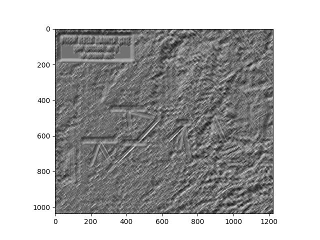

and the code output is as follows

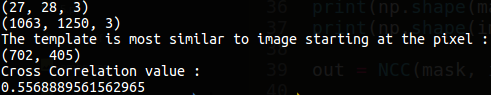

We can clearly see that the correlation score is way lower than the previous case. Also, the correlation output has a much higher intensity than the previous case.

This concludes that Cross Correlation works the best given the template is exaclty cropped from the image and is in the same orientation as in the image.

In real life photographs, we cannot ensure any of these properties to be surely present.

4. (d) A m\*m kernel when overlapped on an n\*n image takes 2m2(n-1)2 operations. If we involve Nr rotations and Ns sizes, we end up with

2NsNrm2(n-1)2 operations

In Big O notation :
NsNrm2n2

### Edge Detection

* Sobel Filter outputs :

Original Image

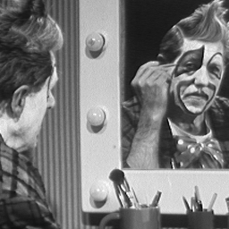

Here are the sobel filter outputs for Gx and Gy kernels.

Horizontal edges

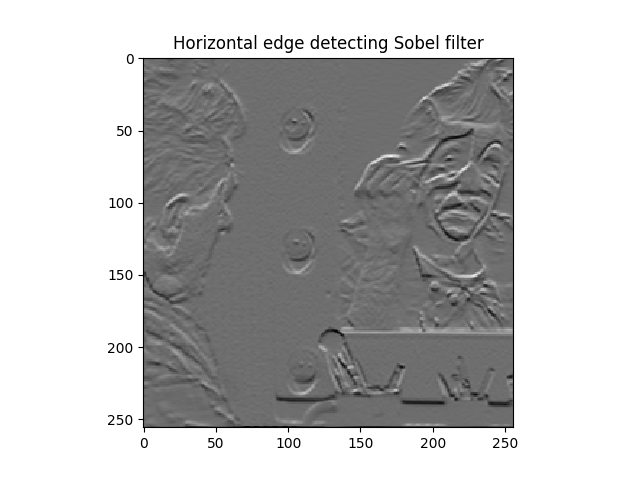

Vertical edges

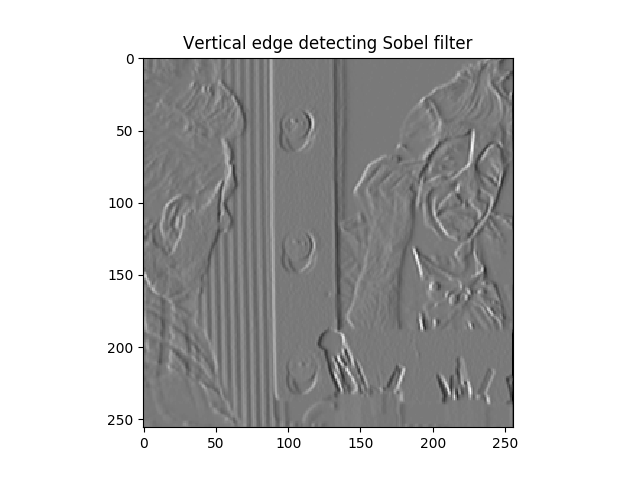

L1 norm of both

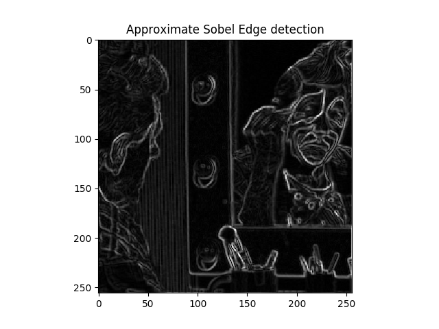

RMS of both

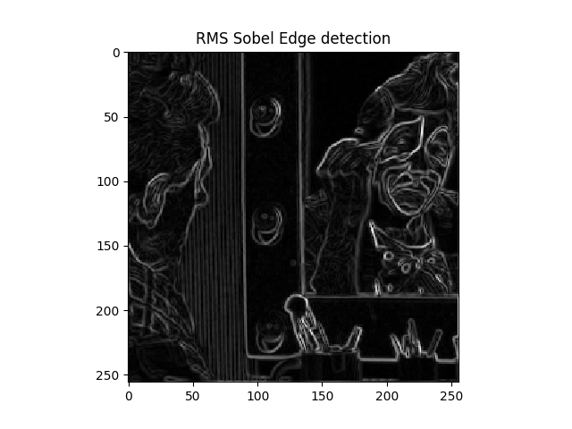

Here we can observe that the kernels indeed work as expected. Also we can observe that the L1 approximation is pretty close to RMS of both outputs

Here is a time comparision between numpy implementation with SCIPY implementation

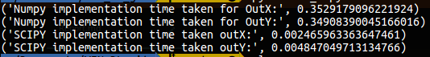

* Laplacian Filter outputs :

Here are the Laplace filter outputs:

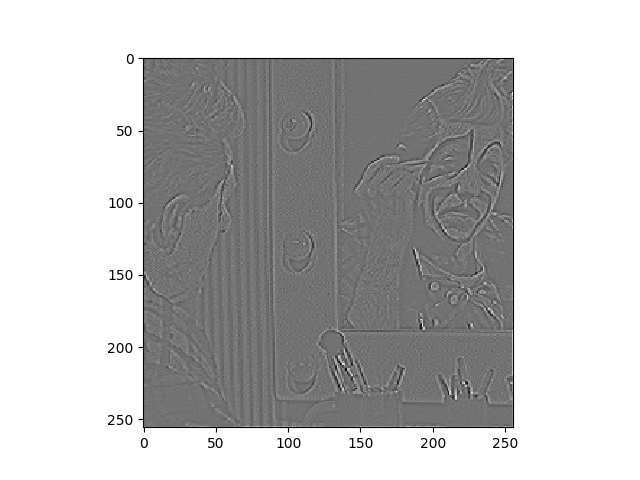

Here is a time comparision between SCIPY and Numpy implementation

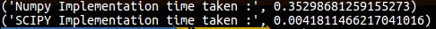

### Hybrid Images

Here is one pair of Hybrid images produced by the code. 4.py is for grayscale images (reduced computation time) and 4_rgb.py is for RGB images (more time taking but a more natural feel for images) 

Einstein

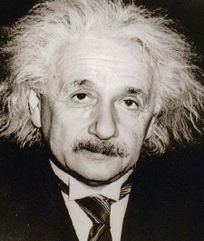

Marilyn

Hybrid image

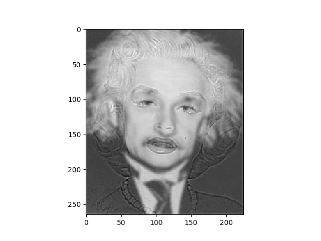

Please note that the cutoff frequency has been replaced with the parameter sigma which determines the standard deviation of the gaussian kernel. The formula relating cutoff frequency with sigma is as follows :

cutoff_freq = 1/(2\*pi\*sigma)

Also note that if we use grayscale images for hybrid outputs, the edges pop out more than necessary, removing the hybrid image feel. RGB images when hybridised blen colors and give a more natural look. Please refer 4_rgb.py for another implementation for RGB images.  

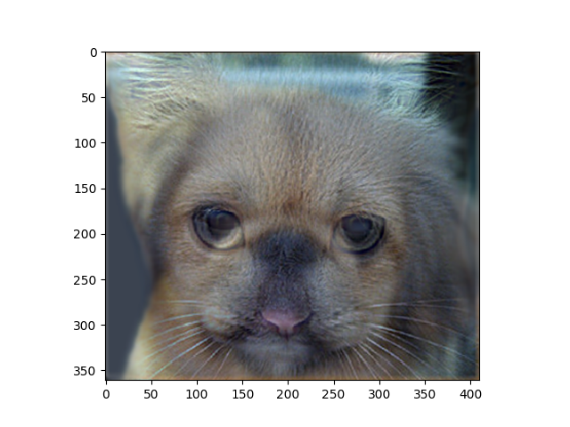

### Decoding GIMP

Emboss effect from GIMP has been considered for this exercise. GIMP uses 3\*3 or 5\*5 kernels for most of the convolutional effects. Digging a bit deeper into GIMP documentation, https://docs.gimp.org/2.8/en/plug-in-convmatrix.html, we find that most of the convolutional effects are indeed implemented using 5\*5 kernels, sometimes with a 0 padding on the outside to reduce to 3\*3 kernels.

For emboss effect, we essentially need to average two images for the depth-ish feel on the borders. If shifting to right side then the top-left elements of the matrix are negative and vice-versa. Taking a look at the kernel, we have kernel coefficients coded accordingly. Please note that GIMP performs some more operation more that just convolution. So results are slightly off but more or less on par.

GIMP results:

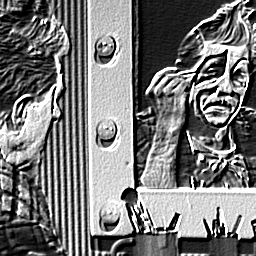

Numpy Implementation:

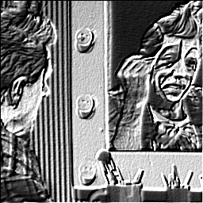